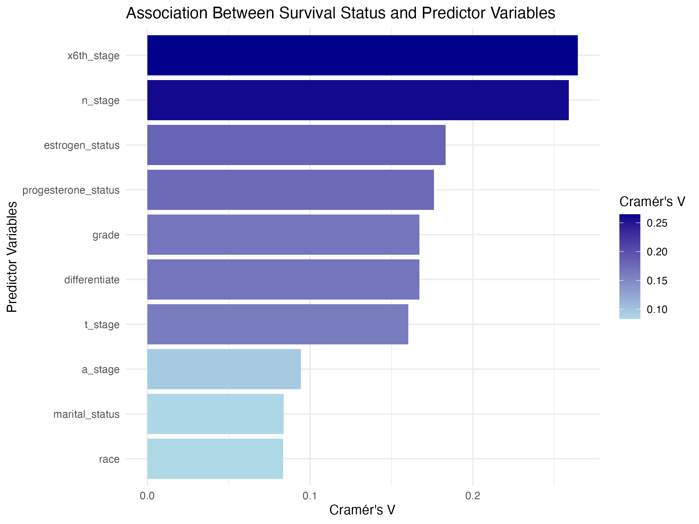
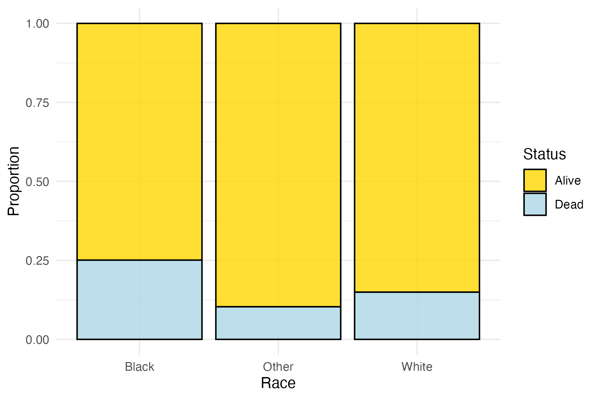
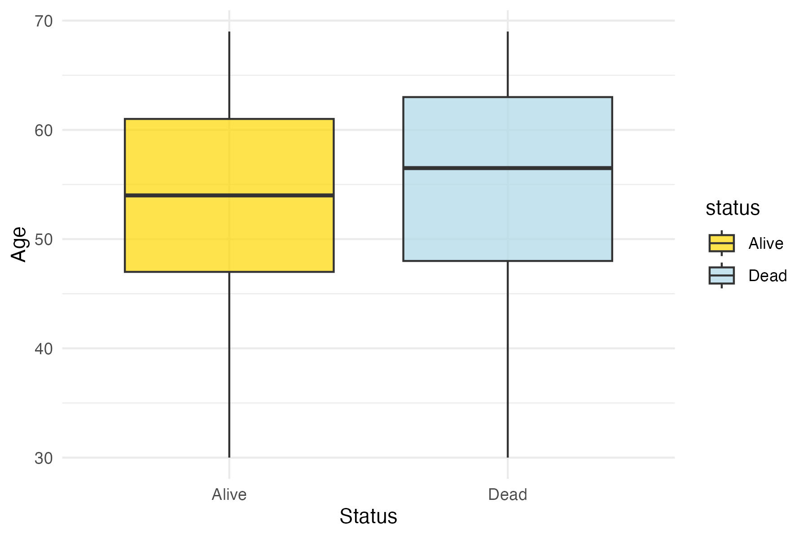
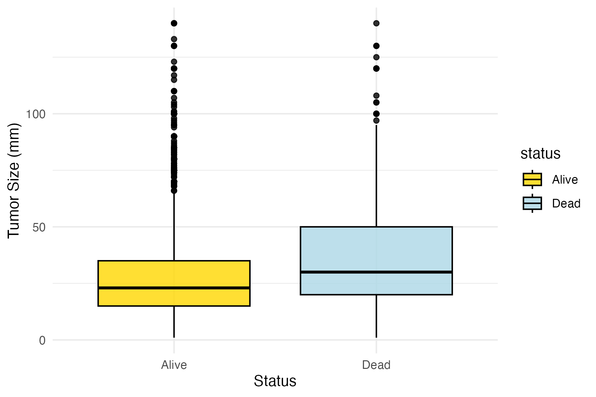
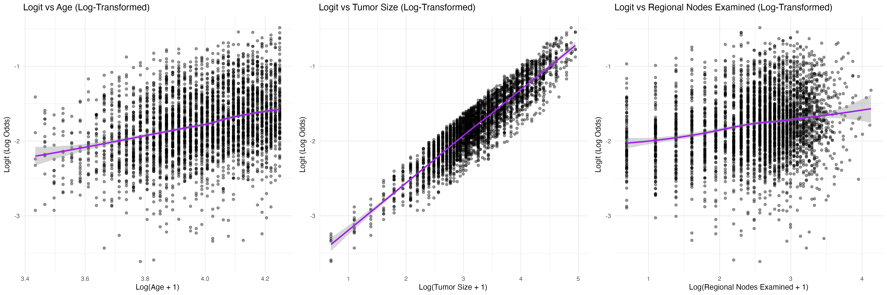
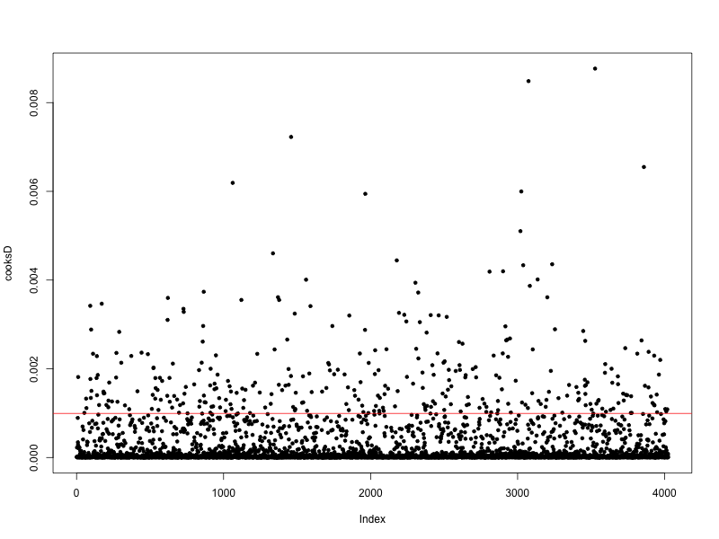

```{r setup, include=FALSE}
knitr::opts_chunk$set(echo = TRUE)
library(tidyverse)
library(janitor)
library(skimr)
library(dplyr)
library(ggplot2)
library(caret)
library(corrplot)
library(lsr)
library(vcd)
library(car)
library(gridExtra)
library(robustbase)
library(leaps)
library(pROC)
library(knitr)
```

## Abstract
Breast cancer is a leading cause of cancer-related mortality among women worldwide. This study develops a predictive model for survival outcomes in breast cancer patients using logistic regression, leveraging demographic, clinical, and pathological factors from a prospective cohort dataset. The analysis focuses on identifying key predictors of mortality, evaluating model performance across racial groups, and addressing fairness in prediction accuracy. Tumor stage, grade, and hormone receptor status emerged as significant predictors. The initial logistic regression model achieved a moderate performance, with an area under the receiver operating characteristic curve (ROC-AUC) of 0.74. However, disparities in model performance were observed between racial groups, prompting the implementation of reweighting strategies to enhance fairness. These findings highlight the importance of equitable modeling approaches to improve prognostic accuracy and clinical outcomes in breast cancer care. 

## Introduction
Breast cancer is highly prevalence with 2.3 million new cases worldwide reported in 2022$^1$. Approximately 13.1 % of female are diagnosed with breast cancer at some point in their lifetime. This type of cancer accounts for 23% of total cancer cases and 14% of cancer deaths$^2$. Advances diagnosis and tailored treatments have reduced mortality rates$3$. Survival of breast cancer depends on various factors including the tumor size, the grade of tumor$^4$, cancer stage, lymph node stages, and socioeconomic and race$^5$. Younger patients often have better outcomes$^6$ while disparities exist for lower-income and African American populations. This report examines data from a prospective cohort of breast cancer patients, which includes variables including demographic, clinical, and pathological factors, aiming to improve outcomes and address disparities.

## Methods

**Data Description** The dataset includes 10 categorical variables: race
(Black, White, Other), marital status (Divorced, Married, Separated,
Single, Widowed), tumor stage (T1, T2, T3, T4), lymph node stage (N1,
N2, N3), adjusted AJCC 6th stage (IIA, IIB, IIIA, IIIB, IIIC), tumor
differentiation (Well, Moderately, Poorly, Undifferentiated), grade
(1–4), tumor spread stage (Regional, Distant), estrogen receptor status
(Positive, Negative), and progesterone receptor status (Positive,
Negative). Additionally, there are 4 continuous variables: age, tumor
size, regional nodes examined, and regional nodes positive.

**Data Cleaning** Column headers were renamed, categorical variables
were converted to factors. tumor grade levels were recoded to ensure
interpretability. Missing values were assessed, and log transformations
were applied to highly skewed continuous variables (tumor size, regional
nodes examined, and regional nodes positive) to normalize their
distributions.

```{r data import and initial tidy, include = FALSE}
# Import data and clean column names
data <- read.csv("./data/Project_2_data.csv") %>% 
  clean_names()

# Select relevant covariates (variables 1-14) and outcome variable
model_data <- data %>%
  dplyr::select(-survival_months)

# Convert categorical variables to factors and relabel `grade`
model_data <- model_data %>%
  mutate(
    race = factor(race),
    marital_status = factor(marital_status),
    t_stage = factor(t_stage),
    n_stage = factor(n_stage),
    x6th_stage = factor(x6th_stage),
    differentiate = factor(differentiate),
    a_stage = factor(a_stage),
    estrogen_status = factor(estrogen_status),
    progesterone_status = factor(progesterone_status),
    status = factor(status, levels = c("Alive", "Dead")),
    grade = case_when(
      grade == "1" ~ "1",
      grade == "2" ~ "2",
      grade == "3" ~ "3",
      grade == " anaplastic; Grade IV" ~ "4",
      TRUE ~ NA_character_
    ) %>% factor(levels = c("1", "2", "3", "4"))
  )

# Summarize structure of the cleaned dataset
summary(model_data)
```

**EDA Methods** `skim()` function is applied to the dataset
(`model_data`) to compute detailed summary statistics for all variables.
(table.1 & 2), Group-wise key statistics are calculated based on
survival status(table.3) Cramér's V was used to quantify the strength of
the association between categorical variables and the binary outcome
(Alive/Dead), with values ranging from 0 (no association) to 1 (perfect
association). Distributional plots, including proportional bar plots for
race groups and histograms for continuous variables, were created to
visualize the data. Boxplots stratified by survival status were used to
explore relationships between continuous variables and the binary
outcome. A correlation matrix for continuous variables was generated to
assess pairwise relationship between variables.

```{r EDA - Summary statistics, echo = FALSE}
# Summary statistics for continuous and categorical variables
skimmed_data <- skim(model_data)

skim_categorical <- skimmed_data %>%
  filter(skim_type == "factor") %>%
  select(-starts_with("numeric"), -skim_type) %>%
  na.omit()
write.csv(skim_categorical, "tables/skim_categorical_summary.csv", row.names = FALSE)

skim_numeric <- skimmed_data %>%
  filter(skim_type == "numeric") %>%
  select(-starts_with("factor"), -skim_type) %>%
  na.omit()
colnames(skim_numeric) <- gsub("^numeric\\.", "", colnames(skim_numeric))
write.csv(skim_numeric, "tables/skim_numeric_summary.csv", row.names = FALSE)

# Key statistics grouped by survival status
summary_by_status <- model_data %>%
  group_by(status) %>%
  summarise(
    mean_age = mean(age, na.rm = TRUE),
    sd_age = sd(age, na.rm = TRUE),
    mean_tumor_size = mean(tumor_size, na.rm = TRUE),
    sd_tumor_size = sd(tumor_size, na.rm = TRUE),
    prop_white = mean(race == "White", na.rm = TRUE),
    prop_black_other = mean(race != "White", na.rm = TRUE),
    n_obs = n()
  )

write.csv(summary_by_status, "tables/summary_by_status.csv", row.names = FALSE)
```

```{r categorical varibales, echo = FALSE, warning =FALSE}
variables <- c("race", "marital_status", "t_stage", "n_stage", "x6th_stage", 
               "differentiate", "grade", "a_stage", "estrogen_status", "progesterone_status")

# Initialize a vector
results <- numeric(length(variables))

for (i in seq_along(variables)) {
  var <- variables[i]
  
  # Select outcome and predictor variable, omit N/A
  df_temp <- model_data %>%
    dplyr::select(status, all_of(var)) %>%
    na.omit()
  
  x <- droplevels(as.factor(df_temp$status))
  y <- droplevels(as.factor(df_temp[[var]]))
  
  # calculate Cramér's V
  table_var <- table(x, y)
  results[i] <- cramersV(table_var)
}

association_df <- data.frame(Variable = variables, CramersV = results)

# Plot Cramér's V values
cramerV_association <- ggplot(association_df, aes(x = reorder(Variable, CramersV), y = CramersV, fill = CramersV)) +
  geom_bar(stat = "identity") +
  coord_flip() +
  scale_fill_gradient(low = "lightblue", high = "darkblue") +
  labs(
    title = "Association Between Survival Status and Predictor Variables",
    x = "Predictor Variables",
    y = "Cramér's V",
    fill = "Cramér's V"
  ) +
  theme_minimal()

ggsave("plots/cramerV_association.png", plot = cramerV_association, width = 8, height = 6)
```

```{r race, echo = FALSE}
# Proportional Bar Plot for Survival Status by Race
race_barplot <- ggplot(model_data, aes(x = race, fill = status)) +
  geom_bar(position = "fill", alpha = 0.8, color = "black") +
  scale_fill_manual(values = c("Alive" = "gold", "Dead" = "lightblue")) +
  theme_minimal() +
  labs(
    x = "Race",
    y = "Proportion",
    fill = "Status"
  )

ggsave("plots/race_proportional_barplot.png", plot = race_barplot, width = 6, height = 4)


# Combine "Black" and "Other" into a single group "Minority Non-White"
model_data_race_combined <- model_data %>%
  mutate(
    race_combined = case_when(
      race == "White" ~ "Majority White",
      race %in% c("Black", "Other") ~ "Minority Non-White"
    ),
    race_combined = factor(race_combined, levels = c("Majority White", "Minority Non-White"))
  )

# Proportional Bar Plot for Combined Race Groups
race_combined_barplot <- ggplot(model_data_race_combined, aes(x = race_combined, fill = status)) +
  geom_bar(position = "fill", alpha = 0.8, color = "black") +
  scale_fill_manual(values = c("Alive" = "gold", "Dead" = "lightblue")) +
  theme_minimal() +
  labs(
    x = "Race Group",
    y = "Proportion",
    fill = "Status"
  )

ggsave("plots/race_combined_proportional_barplot.png", plot = race_combined_barplot, width = 6, height = 4)
```

```{r histogram, include = FALSE}
continuous_vars <- model_data %>%
  dplyr::select(age, tumor_size, regional_node_examined, reginol_node_positive) %>%
  na.omit()

df1 <- as.data.frame(continuous_vars)

hist_list <- lapply(names(continuous_vars), function(col) {
  ggplot(continuous_vars, aes_string(x = col)) +
    geom_histogram(fill = "beige", color = "black", bins = 30) +
    labs(
      title = paste("Histogram of", col),
      x = col,
      y = "Frequency"
    ) +
    theme_minimal()
})

# Arrange plots in a grid
hist_grid <- marrangeGrob(hist_list, nrow = 1, ncol = 4)
ggsave("plots/original_histograms_grid.png", hist_grid, width = 16, height = 4)
```

```{r transform hist, include = FALSE}
df_log <- df1 %>%
  dplyr::select(-tumor_size, -regional_node_examined, -reginol_node_positive) %>%
  mutate(
    tumor_size_log = log(df1$tumor_size + 1),
    rn_examined_log = log(df1$regional_node_examined + 1),
    rn_positive_log = log(df1$reginol_node_positive + 1)
  )

log_hist_list <- lapply(names(df_log), function(col) {
  ggplot(df_log, aes_string(x = col)) +
    geom_histogram(fill = "beige", color = "black", bins = 30) +
    labs(
      title = paste("Histogram of", col, "(Log Transformed)"),
      x = col,
      y = "Frequency"
    ) +
    theme_minimal()
})

# Arrange plots in a grid
log_hist_grid <- marrangeGrob(log_hist_list, nrow = 1, ncol = 4)
ggsave("plots/log_transformed_histograms_grid.png", log_hist_grid, width = 16, height = 4)
```

```{r age, include = FALSE}
# Age by survival status
age_boxplot <- ggplot(model_data, aes(x = status, y = age, fill = status)) +
  geom_boxplot(alpha = 0.7) +
  scale_fill_manual(values = c("Alive" = "gold", "Dead" = "lightblue")) +
  theme_minimal() +
  labs(
    x = "Status",
    y = "Age"
  )

ggsave("plots/age_by_status_boxplot.png", plot = age_boxplot, width = 6, height = 4)
```

```{r tumor size, include = FALSE}
# Tumor size by survival status
tumor_boxplot <- ggplot(model_data, aes(x = status, y = tumor_size, fill = status)) +
  geom_boxplot(alpha = 0.8, color = "black") +
  scale_fill_manual(values = c("Alive" = "gold", "Dead" = "lightblue")) +
  theme_minimal() +
  labs(
    x = "Status",
    y = "Tumor Size (mm)"
  )

ggsave("plots/tumor_size_by_status_boxplot.png", plot = tumor_boxplot, width = 6, height = 4)

# Tumor size by race and survival status
tumor_race_boxplot <- ggplot(model_data, aes(x = race, y = tumor_size, fill = status)) +
  geom_boxplot(alpha = 0.8, color = "black") +
  scale_fill_manual(values = c("Alive" = "gold", "Dead" = "lightblue")) +
  theme_minimal() +
  labs(
    x = "Race",
    y = "Tumor Size (mm)"
  )

ggsave("plots/tumor_size_by_race_status_boxplot.png", plot = tumor_race_boxplot, width = 6, height = 4)
```

```{r rn_examined, include = FALSE}
# Regional Node Examined by survival status
rn_examined_boxplot <- ggplot(model_data, aes(x = status, y = regional_node_examined, fill = status)) +
  geom_boxplot(alpha = 0.7) +
  scale_fill_manual(values = c("Alive" = "gold", "Dead" = "lightblue")) +
  theme_minimal() +
  labs(
    x = "Status",
    y = "regional_node_examined"
  )

ggsave("plots/rn_examined_by_status_boxplot.png", plot = rn_examined_boxplot, width = 6, height = 4)

```

```{r rn_positive, include = FALSE}
# Reginol Node Positive by survival status
rn_positive_boxplot <- ggplot(model_data, aes(x = status, y = reginol_node_positive, fill = status)) +
  geom_boxplot(alpha = 0.7) +
  scale_fill_manual(values = c("Alive" = "gold", "Dead" = "lightblue")) +
  theme_minimal() +
  labs(
    x = "Status",
    y = "regional_node_positive"
  )

ggsave("plots/rn_positive_by_status_boxplot.png", plot = rn_positive_boxplot, width = 6, height = 4)
```

```{r pairwise, include = FALSE}
correlation_matrix <- cor(continuous_vars, use = "pairwise.complete.obs")

# Pairwise relationships (correlation matrix for continuous variables)
correlation_plot <- function() {
  corrplot(
    correlation_matrix,
    method = "circle",
    type = "upper",
    tl.col = "black",
    addCoef.col = "grey",
    number.cex = 0.8,
    tl.cex = 0.9
  )
}

png("plots/correlation_matrix_plot.png", width = 800, height = 600)
correlation_plot()
dev.off()
```

**Modeling Assumptions and Transformations** Logistic regression was
chosen as the primary method due to the binary nature of the outcome.
Assumptions checked are: 1. The response variable (status) was confirmed
to be binary by code.

```{r binary response, include = FALSE}
# Binary or Dichotomous Response Variable
unique(model_data$status)
#The response variable (status) has exactly two categories: Alive and Dead.

```

2\. The `alias()` function identified collinearity between models:
grade2, grade3, and grade4 with other predictors, x6th_stageIIIC with
n_stage, and differentiate with grade. For simplification, some
variables were removed: x6th_stage captures n_stage's information,
n_stage was dropped. t_stage (linked to tumor size), differentiate
(overlapping with grade), and regional_node_positive (redundant with
tumor size and regional_node_examined) were removed.

```{r multicollinearity1, echo = FALSE}
# Fit an initial logistic regression model
model_data_1 <- model_data %>%
  mutate(
    race = relevel(race, ref = "White"),  # Set "White" as reference
    grade = relevel(grade, ref = "1"),    # Set "Grade 1" as reference
    x6th_stage = relevel(x6th_stage, ref = "IIA") # Set "IIA" as reference
  )

alias_results <- capture.output(alias(glm(status ~ ., data = model_data_1, family = binomial)))

writeLines(alias_results, "results/alias_results_model1.txt")
```

VIF were calculated, to ensure that all values were below 5 (table.4),
indicating no multicollinearity. (dataset updated with dropped variable)

```{r multicollinearity2, echo = FALSE}
model_data_2 <- model_data_1 %>%
  dplyr::select(-differentiate, -n_stage, -t_stage, -reginol_node_positive)

# Multicollinearity check with alias()
alias_results_2 <- capture.output(alias(glm(status ~ ., data = model_data_2, family = binomial)))
writeLines(alias_results_2, "results/alias_results_model2.txt")

# Fit a logistic regression model
model_vif <- glm(status ~ ., data = model_data_2, family = binomial)

# Calculate VIF
vif_values <- vif(model_vif)
vif_df <- as.data.frame(vif_values)
vif_df <- tibble::rownames_to_column(vif_df, var = "Variable")
colnames(vif_df) <- c("Variable", "GVIF", "Df", "GVIF_Ratio")
write.csv(vif_df, "tables/vif.csv", row.names = FALSE)
```

3\. Continuous predictors were log-transformed, and their relationships
with the log odds were examined (fig.12). This confirmed linearity.
(dataset updated with transformed variable)

```{r Log Odds, include = FALSE, message = FALSE}
continuous_vars_log_odds <- model_data_2 %>%
  dplyr::select(age, tumor_size, regional_node_examined, status) %>%  # Include 'status'
  na.omit()

# Log-transform tumor size and regional nodes examined
df_log_odds <- continuous_vars_log_odds %>%
  mutate(
    age_log = log(age + 1),
    tumor_size_log = log(tumor_size + 1),
    rn_examined_log = log(regional_node_examined + 1)
  )

linearity_test <- glm(status ~ age_log + tumor_size_log + rn_examined_log, 
                      data = df_log_odds, 
                      family = binomial)

df_log_odds$logit <- predict(linearity_test, type = "link") 


plot1 <- ggplot(df_log_odds, aes(x = age_log, y = logit)) +
  geom_point(alpha = 0.4) +
  geom_smooth(method = "loess", color = "purple") +
  labs(title = "Logit vs Age (Log-Transformed)", 
       x = "Log(Age + 1)", y = "Logit (Log Odds)") +
  theme_minimal()

plot2 <- ggplot(df_log_odds, aes(x = tumor_size_log, y = logit)) +
  geom_point(alpha = 0.4) +
  geom_smooth(method = "loess", color = "purple") +
  labs(title = "Logit vs Tumor Size (Log-Transformed)", x = "Log(Tumor Size + 1)", y = "Logit (Log Odds)") +
  theme_minimal()

plot3 <- ggplot(df_log_odds, aes(x = rn_examined_log, y = logit)) +
  geom_point(alpha = 0.4) +
  geom_smooth(method = "loess", color = "purple") +
  labs(title = "Logit vs Regional Nodes Examined (Log-Transformed)", 
       x = "Log(Regional Nodes Examined + 1)", y = "Logit (Log Odds)") +
  theme_minimal()

log_odds_grid <- grid.arrange(plot1, plot2, plot3, ncol = 3)
ggsave("plots/logit_grid_plot.png", plot = log_odds_grid, width = 18, height = 6)

# Update
model_data_3 <- model_data_2 %>%
  mutate(
    tumor_size_log = log(tumor_size + 1),
    rn_examined_log = log(regional_node_examined + 1),
    age_log = log(age + 1)
  ) %>%
  dplyr::select(-tumor_size, -regional_node_examined, -age) 
```

4\. Independence of Errors: Since there were no group-level structures,
the independence assumption was satisfied.

```{r outliers1, include = FALSE}
# Fit logistic regression model with log-transformed predictors
full_model <- glm(status ~ ., 
                 data = model_data_3, family = binomial)

# Cook's Distance
cooksD <- cooks.distance(model_vif)

# Plot
png("plots/cooks_distance_plot.png", width = 800, height = 600)
plot(cooksD, pch = 20)
abline(h = 4 / nrow(model_data_3), col = "red")
dev.off()

# Identify
influential_obs <- which(cooksD > 4 / nrow(model_data_3))

# Build Model
model_no_outliers <- glm(status ~ ., 
                         data = model_data_3[-influential_obs, ], family = binomial)

model_robust <- glmrob(status ~ .,
                       data = model_data_3, family = binomial, method = "Mqle")

# Extract summaries
full_coefficients <- summary(full_model)$coefficients
no_outliers_coefficients <- summary(model_no_outliers)$coefficients
robust_coefficients <- summary(model_robust)$coefficients

# Identify unstable coefficients
unstable_coeffs <- which(
  (abs(full_coefficients[, "Estimate"] - no_outliers_coefficients[, "Estimate"]) > 2) |
  (abs(full_coefficients[, "Std. Error"] - no_outliers_coefficients[, "Std. Error"]) > 2)
)
unstable_coeffs_df <- data.frame(
  Variable = rownames(full_coefficients)[unstable_coeffs],
  Full_Coef = full_coefficients[unstable_coeffs, "Estimate"],
  Full_SE = full_coefficients[unstable_coeffs, "Std. Error"],
  No_Outliers_Coef = no_outliers_coefficients[unstable_coeffs, "Estimate"],
  No_Outliers_SE = no_outliers_coefficients[unstable_coeffs, "Std. Error"],
  Robust_Coef = robust_coefficients[rownames(full_coefficients)[unstable_coeffs], "Estimate"],
  Robust_SE = robust_coefficients[rownames(full_coefficients)[unstable_coeffs], "Std. Error"]
)

write.csv(unstable_coeffs_df, "tables/unstable_coefficients.csv", row.names = FALSE)
```

```{r outliers2, echo = FALSE, results='hide'}
# Extract robustness weights
robust_summary <- capture.output(summary(model_robust))
start_line <- grep("Robustness weights w.r \\* w.x:", robust_summary)
end_line <- start_line + 5
desired_section <- robust_summary[start_line:end_line]
cat(paste(desired_section, collapse = "\n"))
```

5\. Outliers: Cook's Distance identified potential outliers exceeding
4/n, which flagged numerous points as influential, likely reflecting
population variability rather than errors (fig.12). Models with and
without these points were compared. Removing these points destabilized
coefficients like grade, making them unreliable. Robust logistic
regression (model_robust) mitigated outliers impact, providing stable
estimates for predictors (table.5). About 12% of data had reduced
influence, while most observations are unaffected. Despite its
advantages, we chose the original logistic regression for simplicity and
familiarity.

**Model Construction and Selection** Models were constructed using
predictors identified during EDA and assumption checks. Forward,
backward, and stepwise selection were applied based on the AIC to select
the final model. Interaction effects were tested by examining pairwise interactions between predictors. 

**Model Validation and Fairness** The model was validated using 10-fold
cross-validation, evaluating ROC-AUC, sensitivity, and specificity.
Fairness was assessed by evaluating model performance across racial
subgroups (White, Black, Other) based on subgroup-specific ROC-AUC
values. To address disparities, inverse probability weighting (IPW) was applied: the proportions were computed as the size of each group divided by the total sample size (White: 3413, Other: 320, Black: 291) (table.1). The weights `W` were then derived as follows: $W = \frac{1}{\text{Proportion}}$.The calculated weights were 1.18 for White, 13.89 for Black, and 12.50 for Other. To keep weights manageable, we normalized them such that the maximum weight was scaled to 2, resulting in final weights of 0.17 for White, 2.00 for Black, and 1.80 for Other. The reweighted model's performance was then compared to the original, using subgroup-specific and overall AUC values to assess predictive fairness. Predictor coefficients were interpreted as odds ratios to quantify their impact on survival outcomes.


## Results
**EDA** Cramér’s V analysis identified `x6th_stage`, `n_stage`, and
hormone receptor statuses as the strongest predictors of survival, while
`marital status`, `race`, and `a_stage` showed weaker associations
(fig.1). Bar plots highlight racial disparities, with higher mortality
among Non-White, particularly Black patients, and combining groups
simplifies comparisons (figs.2–3). Histograms revealed significant right
skewness for most continuous variables (except `age`), improved by log
transformations for the other continuous vars (figs.4–5). Boxplots
confirm these patterns (figs.6–10). A correlation matrix showed weak
overall relationships and no multicollinearity, except
`regional_node_positive` is moderately associated with both `tumor size`
(0.24) and `regional nodes examined` (0.41), guiding modeling choices
(fig.11).

**Model Selection and Intepretation**

```{r variable selection original, echo = FALSE}
# Forward selection
forward_model <- step(glm(status ~ ., data = model_data_3, family = binomial), scope = list(lower = ~1, upper = full_model), direction = "forward", trace = 0)

# Backward elimination
backward_model <- step(glm(status ~ ., data = model_data_3, family = binomial), direction = "backward", trace = 0)

# Stepwise selection
stepwise_model <- step(glm(status ~ ., data = model_data_3, family = binomial), scope = list(lower = ~1, upper = full_model), direction = "both", trace = 0)

writeLines(capture.output(summary(full_model)), "results/full_model_summary.txt")
writeLines(capture.output(summary(forward_model)), "results/forward_model_summary.txt")
writeLines(capture.output(summary(backward_model)), "results/backward_model_summary.txt")
writeLines(capture.output(summary(stepwise_model)), "results/stepwise_model_summary.txt")
```
AIC values differed slightly (Full: 3039.8; Forward: 3039.8; Backward: 3037.5; Stepwise: 3037.5), but all methods yielded the same model. The stepwise model was chosen for its lower AIC (full results attached):
$$Logit(P) = \beta_0 + \beta_1 \times raceBlack + \beta_2 \times raceOther + \ldots + \beta_i \times X_i $$
Where $\beta_i$ and $X_i$(significant predictors) are taken from Table 6, and $Logit(P) = log(\frac{P}{1-P})$, P is the probability of the `status` being 1.

```{r interacting effects, echo = FALSE, results='hide'}
# Define predictors
predictors <- c("race", "marital_status", "x6th_stage", "grade", 
                "estrogen_status", "progesterone_status", "rn_examined_log", "age_log")

interaction_results <- data.frame(
  Predictor1 = character(),
  Predictor2 = character(),
  P_Value = numeric(),
  stringsAsFactors = FALSE
)

# Loop through pair of predictors
for (i in seq_along(predictors)) {
  for (j in seq_along(predictors)) {
    if (i < j) {
      predictor1 <- predictors[i]
      predictor2 <- predictors[j]
      
      # Fit interaction model
      formula <- as.formula(paste("status ~", paste(predictors, collapse = " + "), 
                                  "+", predictor1, "*", predictor2))
      interaction_model <- glm(formula, family = binomial, data = model_data_3)
      
      # Extract interaction term
      interaction_term <- paste(predictor1, predictor2, sep = ":")
      coef_names <- names(coef(interaction_model))
      
      if (interaction_term %in% coef_names) {
        # Extract p-value for the interaction term
        p_value <- coef(summary(interaction_model))[interaction_term, "Pr(>|z|)"]
        
        # if p-value < 0.05
        if (p_value < 0.05) {
          interaction_results <- rbind(interaction_results, 
                                       data.frame(Predictor1 = predictor1, 
                                                  Predictor2 = predictor2, 
                                                  P_Value = p_value, 
                                                  stringsAsFactors = FALSE))
        }
      }
    }
  }
}

# Sort by p-value
interaction_results <- interaction_results[order(interaction_results$P_Value), ]
print(interaction_results)
```

**Interaction Effects** Pairwise interactions between predictors were tested, but none of the interaction terms had p-values below 0.05, consistent with earlier analyses showing weak or absent interaction effects (results attached)

```{r coefficients, include=FALSE}
stepwise_summary <- summary(stepwise_model)
stepwise_coefficients <- as.data.frame(stepwise_summary$coefficients)

# Calculate Odds Ratios and Confidence Intervals
odds_ratios <- exp(stepwise_coefficients[, "Estimate"])
lower_ci <- exp(stepwise_coefficients[, "Estimate"] - 1.96 * stepwise_coefficients[, "Std. Error"])
upper_ci <- exp(stepwise_coefficients[, "Estimate"] + 1.96 * stepwise_coefficients[, "Std. Error"])

stepwise_result_table <- data.frame(
  Predictor = rownames(stepwise_coefficients),
  Estimate = round(stepwise_coefficients[, "Estimate"], 3),
  Std_Error = round(stepwise_coefficients[, "Std. Error"], 3),
  Odds_Ratio = round(odds_ratios, 3),
  `95% CI (Lower)` = round(lower_ci, 3),
  `95% CI (Upper)` = round(upper_ci, 3),
  `P-Value` = format.pval(stepwise_coefficients[, "Pr(>|z|)"], digits = 3)
)
rownames(stepwise_result_table) <- NULL

write.csv(stepwise_result_table, "tables/stepwise_model_results.csv", row.names = FALSE)
```

```{r performance, echo = FALSE}
set.seed(123)
control <- trainControl(method = "cv", number = 10, classProbs = TRUE, summaryFunction = twoClassSummary)

cv_model <- train(
  status ~ race + marital_status + x6th_stage + grade + estrogen_status + 
    progesterone_status + rn_examined_log + age_log,
  data = model_data_3,
  method = "glm",
  family = "binomial",
  trControl = control,
  metric = "ROC"
)

performance_summary <- capture.output(cv_model)
writeLines(performance_summary, "results/cv_model_performance.txt")
```

**Model Performance**  Cross-validation (10-fold) revealed an overall ROC-AUC of 0.7400, indicating moderately good performance with an acceptable ability to
distinguish between "Alive" and "Dead" outcomes. The model demonstrated
high sensitivity (0.985), meaning it correctly identifies most of the "Dead" cases, but low specificity (0.122), indicating difficulty in correctly identifying "Alive" cases (full results attached).
```{r fairness, echo = FALSE, message = FALSE, warning = FALSE}
# Split by race group
white_data <- model_data_3 %>% filter(race == "White")
minority_data <- model_data_3 %>% filter(race != "White")
black_data <- model_data_3 %>% filter(race == "Black")
other_data <- model_data_3 %>% filter(race == "Other")

# Predict for White group
pred_white <- predict(cv_model, newdata = white_data, type = "prob")[, "Dead"]
roc_white <- roc(white_data$status, pred_white)
auc_white <- auc(roc_white)

# Predict for Minority group
pred_minority <- predict(cv_model, newdata = minority_data, type = "prob")[, "Dead"]
roc_minority <- roc(minority_data$status, pred_minority)
auc_minority <- auc(roc_minority)

# Predict for Black group
pred_black <- predict(cv_model, newdata = black_data, type = "prob")[, "Dead"]
roc_black <- roc(black_data$status, pred_black)
auc_black <- auc(roc_black)

# Predict for Other group
pred_other <- predict(cv_model, newdata = other_data, type = "prob")[, "Dead"]
roc_other <- roc(other_data$status, pred_other)
auc_other <- auc(roc_other)
```

```{r reweight subgroup, echo = FALSE, warning = FALSE, message = FALSE, results = 'hide'}
# Assign weights based on normalized inverse probabilities
model_data_4 <- model_data_3 %>%
  mutate(weight = case_when(
    race == "White" ~ 0.17,
    race == "Black" ~ 2.00,
    race == "Other" ~ 1.80
  ))

minority_data <- model_data_4 %>% filter(race != "White")

# Refit the model with weights
reweighted_model <- train(
  status ~ race + marital_status + x6th_stage + grade + estrogen_status + 
    progesterone_status + rn_examined_log + age_log,
  data = model_data_4,
  method = "glm",
  family = "binomial",
  trControl = control,
  weights = weight
)

# Evaluate performance on subgroups
pred_white_weighted <- predict(reweighted_model, newdata = white_data, type = "prob")[, "Dead"]
roc_white_weighted <- roc(white_data$status, pred_white_weighted)
auc_white_weighted <- auc(roc_white_weighted)

pred_minority_weighted <- predict(reweighted_model, newdata = minority_data, type = "prob")[, "Dead"]
roc_minority_weighted <- roc(minority_data$status, pred_minority_weighted)
auc_minority_weighted <- auc(roc_minority_weighted)

pred_black_weighted <- predict(reweighted_model, newdata = black_data, type = "prob")[, "Dead"]
roc_black_weighted <- roc(black_data$status, pred_black_weighted)
auc_black_weighted <- auc(roc_black_weighted)

pred_other_weighted <- predict(reweighted_model, newdata = other_data, type = "prob")[, "Dead"]
roc_other_weighted <- roc(other_data$status, pred_other_weighted)
auc_other_weighted <- auc(roc_other_weighted)

auc_comparison_summary <- data.frame(
  Model = factor(c("Original", "Reweighted"), levels = c("Original", "Reweighted")),
  White = c(auc_white, auc_white_weighted),
  Black = c(auc_black, auc_black_weighted),
  Other = c(auc_other, auc_other_weighted),
  Minority = c(auc_minority, auc_minority_weighted)
)

auc_comparison_summary[, 2:5] <- round(auc_comparison_summary[, 2:5], 4)
write.csv(auc_comparison_summary, "tables/auc_comparison_summary.csv", row.names = FALSE)
```

```{r reweight summary, echo = FALSE}
# Extract coefficients and CI from the reweighted model
summary_reweighted <- summary(reweighted_model$finalModel)
coefficients <- coef(summary_reweighted)

# Calculate Odds Ratios and 95% CI
odds_ratios <- exp(coefficients[, "Estimate"])
lower_ci <- exp(coefficients[, "Estimate"] - 1.96 * coefficients[, "Std. Error"])
upper_ci <- exp(coefficients[, "Estimate"] + 1.96 * coefficients[, "Std. Error"])

# Combine
results_table <- data.frame(
  Predictor = rownames(coefficients),
  Estimate = round(coefficients[, "Estimate"], 3),
  Std_Error = round(coefficients[, "Std. Error"], 3),
  Odds_Ratio = round(odds_ratios, 3),
  `95% CI (Lower)` = round(lower_ci, 3),
  `95% CI (Upper)` = round(upper_ci, 3),
  `P-Value` = format.pval(coefficients[, "Pr(>|z|)"], digits = 3)
)
rownames(results_table) <- NULL

write.csv(results_table, "tables/reweighted_model_results.csv", row.names = FALSE)
```
The model performance varies across different racial groups.It demonstrates high ROC-AUC for the White group (0.7504), while the lower scores were evaluated for the Black group (0.7021) and Other group (0.6584).When Black and Other groups are combined as a single minority group, the model ROC-AUC improves to 0.7313, though it remains lower than the majority White group.
Reweighting narrowed this gap, increasing the model’s ROC-AUC for the minority group to 0.7358, closer to the White group (0.7486), improving fairness while maintaining accuracy (table.8). The model equation must be adjusted accordingly if the reweighted model is chosen: $$Logit(P) = \beta_0 + \beta_1 \times raceBlack + \ldots + \beta_i \times X_i$$ where $\beta_i$ values are from Table 7, and $X_i$ represents the same significant predictors as in the original stepwise model.

**Key Findings on Coefficients** Tables 6 and 7 present the key predictors and odds ratios from the original stepwise model and the reweighted model, respectively. In both models, race was significant: in the stepwise model, `raceBlack` (OR = 1.615) increased mortality odds by 61.5%, and `raceOther` (OR = 0.651) reduced them by 34.9%, while in the reweighted model, `raceBlack` (OR = 1.423) increased odds by 42.3% and `raceOther` (OR = 0.667) reduced them by 33.3%. `x6th_stage` was the strongest predictor across both models, with odds ratios in the original model (`IIIA`: 2.683, `IIIB`: 4.820, `IIIC`: 7.682) and reweighted model (`IIIA`: 2.505, `IIIB`: 4.163, `IIIC`: 6.255) showing progressively higher mortality risk. Poorly differentiated tumors (`Grade 3` and `Grade 4`) substantially raised mortality odds in both models. Positive hormone receptor status (e.g. estrogen: OR = 0.485 for stepwise; OR = 0.572 for reweighted) was protective. Other predictors, such as lymph nodes examined and age, showed consistent trends, with more nodes examined improving survival and older age increasing mortality risk, though these were non-significant in the reweighted model. Marital status showed no significant associations in either model.

## Conclusion and Limitation
In this study, we developed a logistic regression model to predict the odds of survival for breast cancer patients, selecting the final model using stepwise AIC-based selection. Key predictors included `x6th_stage`, `grade`, `rn_examined_log`, `age_log`, hormone receptor status, and marital status. The most significant predictors were adjusted AJCC 6th stage and tumor grade, consistent with existing literature. Advanced tumor stages (e.g. IIIC: OR = 6.255) and poorly differentiated tumors (e.g. Grade 4: OR = 6.510) were associated with higher mortality odds. Conversely, hormone receptor positive status was protective, reflecting improved outcomes for hormone-sensitive tumors. More regional lymph nodes examined increased survival odds, while older age significantly raised mortality risk. 
Racial disparities were evident, with Black patients facing higher odds of death compared to White patients (stepwise OR = 1.615; reweighted OR = 1.423) and patients in the "Other" category showing lower odds (stepwise OR = 0.651; reweighted OR = 0.667). 
Reweighting improved fairness for underrepresented groups, increasing the minority group’s ROC-AUC from 0.7313 to 0.7358 and narrowing the gap with the White group (0.7486). However, it may reduce generalizability to majority-dominant populations and alter predictor importance, requiring careful interpretation. Stepwise selection treated factor levels as independent variables (e.g., `x6th_stageIIIA` as a dummy), potentially excluding some levels and raising interpretability concerns. Marital status was retained in the final model despite weak significance due to its potential theoretical relevance, confounding effects, or fairness considerations. All three aspects—reweighting, factor level treatment, and marital status inclusion—require further research to ensure robustness and interpretability.

## Contribution
All members participated in group discussions, and editing reports.
Ada Guo drafted the abstract, introduction, and results-eda. 
Khue Nguyen analyzed and draft results, conclusion and limitations, refined results structure, add references. 
Yixin Zheng wrote the methods, revise the results, conclusion, limitation,
and constructed the Rmd file(cleaning, correlation matrix, Cramér's V,
assumption checks, feature selection, model, cross-validation, fairness
reweight, appendix).

## Reference
1.	Arnold M, Morgan E, Rumgay H, et al. Current and future burden of breast cancer: Global statistics for 2020 and 2040. Breast Off J Eur Soc Mastology. 2022;66:15-23. doi:10.1016/j.breast.2022.08.010
2.	Cao SS, Lu CT. Recent perspectives of breast cancer prognosis and predictive factors. Oncol Lett. 2016;12(5):3674-3678. doi:10.3892/ol.2016.5149
3.	Cancer of the Breast (Female) - Cancer Stat Facts. SEER. Accessed December 19, 2024. https://seer.cancer.gov/statfacts/html/breast.html
4.	Bundred NJ. Prognostic and predictive factors in breast cancer. Cancer Treat Rev. 2001;27(3):137-142. doi:10.1053/ctrv.2000.0207
5.	Soerjomataram I, Louwman MWJ, Ribot JG, Roukema JA, Coebergh JWW. An overview of prognostic factors for long-term survivors of breast cancer. Breast Cancer Res Treat. 2008;107(3):309-330. doi:10.1007/s10549-007-9556-1
6.	Phung MT, Tin Tin S, Elwood JM. Prognostic models for breast cancer: a systematic review. BMC Cancer. 2019;19(1):230. doi:10.1186/s12885-019-5442-6

\newpage

## Table, Plots, and Code Results

### Tables

```{r table, echo=FALSE, eval=TRUE}
skim_categorical <- read.csv("tables/skim_categorical_summary.csv")
knitr::kable(skim_categorical, caption = "Skim Summary for Categorical Variables")

skim_numeric <- read.csv("tables/skim_numeric_summary.csv")
knitr::kable(skim_numeric, caption = "Skim Summary for Numeric Variables")

summary_by_status <- read.csv("tables/summary_by_status.csv")
knitr::kable(summary_by_status, caption = "Summary Statistics Grouped by Survival Status")

vif_table <- read.csv("tables/vif.csv")
knitr::kable(vif_table, caption = "Variance Inflation Factors for Predictors")

unstable_table <- read.csv("tables/unstable_coefficients.csv")
knitr::kable(unstable_table, caption = "Unstable Coefficients")

stepwise_result_table <- read.csv("tables/stepwise_model_results.csv")
knitr::kable(stepwise_result_table, caption = "Stepwise Model Results")

reweighted_model_results <- read.csv("tables/reweighted_model_results.csv")
knitr::kable(reweighted_model_results, caption = "Reweighted Logistic Regression Model Results")

auc_table <- read.csv("tables/auc_comparison_summary.csv")
knitr::kable(auc_table, caption = "Comparison of ROC-AUC Values Across Models and Racial Groups", col.names = c("Model Type", "White", "Black", "Other", "Minority"))
```

\newpage

### Plots















\newpage

### Code Results

For full code results, please refer to the `.txt` files available in the
`results` folder of the GitHub repository: https://github.com/Yixin-Zheng/p8130_finalproject.

## Code Appendix

```{r ref.label=knitr::all_labels(), echo = T, eval = F}

```
